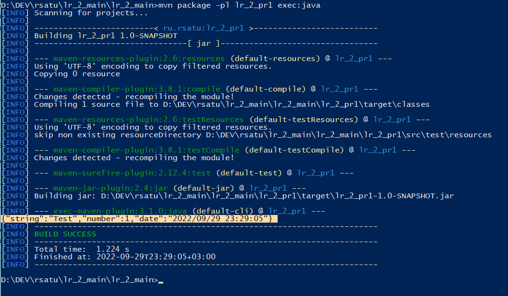
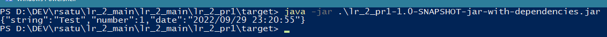
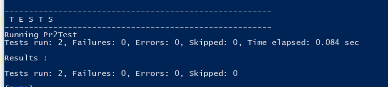

= Отчет по лабораторной работе 2
:listing-caption: Листинг
:source-highlighter: coderay

Студент: Рябков Владислав Алексеевич

Группа: ПИМ-22

== 1. Постановка задачи

В процессе выполнения лабораторной работы необходимо выполнить следующие задачи:

. Создать несколько maven-проектов:
    - Родительский
    - 2 Дочерних (1 дочерний проект зависит от второго)
. Подключить внешнюю зависимость (из глобального репозитория) в один из проектов и продемонстрировать работу этой зависимости.
. Создать maven-проект, который будет помещен в локальный репозиторий. Добавить этот проект как зависимость в проект из п.1
. Создать maven-проект, упаковать его в jar-with-dependencies, продемонстрировать работу jar. Запустить проект с помощью maven.
. Выполнить тест подключенной зависимости из п.2 с помощью junit

== 2. Разработка задачи

=== 2.1 Структура проекта

Проект разделен на следующие директории:

/lr_2_main:::
Директория с родительским maven-проектом

/lr_2_main/lr_2_lib:::
Директория с maven-проектом, который был подключен как библиотека через локальный репозиторий

/lr_2_main/lr_2_pr1:::
Директория с дочерним maven-проектом, который имеет в зависиомсти lr_2_lib и lr_2_pr2. А также конфигурацию для упаковки с зависимостями.

/lr_2_main/lr_2_pr2:::
Директория с дочерним maven-проектом, который имеет в зависимости библиотеки Gson и juint из удаленного репозитория.

/result:::
Отчет по проделанной работе

== 3. Информация о реализации

=== 3.1 Задание 1

Для выполнения первого задания создан maven проект со следующей конфигурацией.

Состоит из трех проектов:

 - Родительсикй lr_2_main
 - Дочерний lr_2_pr1, который имеет в зависимости lr_2_pr2
 - Дочерний lr_2_pr2

.Родительский pom.xml
[source,xml]
----
<?xml version="1.0" encoding="UTF-8"?>
<project xmlns="http://maven.apache.org/POM/4.0.0"
         xmlns:xsi="http://www.w3.org/2001/XMLSchema-instance"
         xsi:schemaLocation="http://maven.apache.org/POM/4.0.0 http://maven.apache.org/xsd/maven-4.0.0.xsd">
    <modelVersion>4.0.0</modelVersion>

    <groupId>ru.rsatu</groupId>
    <artifactId>lr_2_main</artifactId>
    <packaging>pom</packaging>
    <version>1.0-SNAPSHOT</version>
    <modules>
        <module>lr_2_pr1</module>
        <module>lr_2_pr2</module>
    </modules>

    <properties>
        <maven.compiler.source>8</maven.compiler.source>
        <maven.compiler.target>8</maven.compiler.target>
        <project.build.sourceEncoding>UTF-8</project.build.sourceEncoding>
    </properties>

</project>
----

.Файл pom.xml первого дочернего проекта

[source,xml]
----
<?xml version="1.0" encoding="UTF-8"?>
<project xmlns="http://maven.apache.org/POM/4.0.0"
         xmlns:xsi="http://www.w3.org/2001/XMLSchema-instance"
         xsi:schemaLocation="http://maven.apache.org/POM/4.0.0 http://maven.apache.org/xsd/maven-4.0.0.xsd">
    <parent>
        <artifactId>lr_2_main</artifactId>
        <groupId>ru.rsatu</groupId>
        <version>1.0-SNAPSHOT</version>
    </parent>
    <modelVersion>4.0.0</modelVersion>

    <artifactId>lr_2_pr1</artifactId>

    <dependencies>
        <dependency>
            <groupId>ru.rsatu</groupId>
            <artifactId>lr_2_pr2</artifactId>
            <version>1.0-SNAPSHOT</version>
        </dependency>
    </dependencies>

    <properties>
        <exec.mainClass>ru.rsatu.Main</exec.mainClass>
    </properties>
</project>
----

.Файл pom.xml второго дочернего проекта

[source,xml]
----
<?xml version="1.0" encoding="UTF-8"?>
<project xmlns="http://maven.apache.org/POM/4.0.0"
         xmlns:xsi="http://www.w3.org/2001/XMLSchema-instance"
         xsi:schemaLocation="http://maven.apache.org/POM/4.0.0 http://maven.apache.org/xsd/maven-4.0.0.xsd">
    <parent>
        <artifactId>lr_2_main</artifactId>
        <groupId>ru.rsatu</groupId>
        <version>1.0-SNAPSHOT</version>
    </parent>
    <modelVersion>4.0.0</modelVersion>

    <artifactId>lr_2_pr2</artifactId>
</project>
----

=== 3.2 Задание 2

Для выполнения этого задания добавим в проект - lr_2_pr2 библиотеку Gson

Это потребует следующие изменения в файле pom.xml

.Изменения в pom.xml
[source,xml]
----
    <dependencies>
        <dependency>
            <groupId>com.google.code.gson</groupId>
            <artifactId>gson</artifactId>
            <version>2.9.1</version>
        </dependency>
    </dependencies>

    <properties>
        <exec.mainClass>ru.rsatu.Main_lr2</exec.mainClass>
    </properties>
----

.Класс Main_lr2
[source,java]
----
package ru.rsatu;

import com.google.gson.Gson;

public class Main_lr2 {
    public static void main(String[] args) {
        Gson gson = new Gson();

        Data data = new Data("Тест", 1);

        String json = gson.toJson(data, Data.class);
        System.out.println(json);
    }

    static class Data{
        String string;
        int number;

        public Data(String string, int number) {
            this.string = string;
            this.number = number;
        }
    }
}
----

Чтобы запустить и увидеть результат, использовалась следующая команда

.Команда для запуска проекта lr_2_pr2
----
mvn package -pl lr_2_pr2 exec:java
----

.Результат работы проекта lr_2_pr2
----
{"string":"Тест","number":1}
----

=== 3.3 Задание 3

Для выполнения третьего задания был создан проект lr_2_lib. Проект собран и отправлен в локальный репозиторий с использованием команд

.Класс TimeLib проекта lr_2_lib
[source,java]
----
package ru.rsatu;

import java.time.LocalDateTime;
import java.time.format.DateTimeFormatter;

public class TimeLib {
    public static String getDate() {
        DateTimeFormatter dtf = DateTimeFormatter.ofPattern("yyyy/MM/dd HH:mm:ss");
        LocalDateTime now = LocalDateTime.now();
        return dtf.format(now);
    }
}
----

Далее проект необходимо собрать и добавить в локальный репозиторий.

.Команда для сборки lr_2_lib
----
mvn package -pl lr_2_lib compile
mvn package -pl lr_2_lib install
----

Добавим эту библиотеку в зависимости lr_2_pr2

.Фрагмент pom.xml lr_2_pr2
[source,xml]
----
    <dependencies>
        <dependency>
            <groupId>com.google.code.gson</groupId>
            <artifactId>gson</artifactId>
            <version>2.9.1</version>
        </dependency>
        <dependency>
            <groupId>ru.rsatu</groupId>
            <artifactId>lr_2_lib</artifactId>
            <version>1.0-SNAPSHOT</version>
        </dependency>
    </dependencies>
----

=== 3.4 Задание 4

Для выполнения четвертого задания у проекта lr_2_pr1 модифицирован файл pom.xml

.Файл pom.xml lr_2_pr1
[source,xml]
----
<?xml version="1.0" encoding="UTF-8"?>
<project xmlns="http://maven.apache.org/POM/4.0.0"
         xmlns:xsi="http://www.w3.org/2001/XMLSchema-instance"
         xsi:schemaLocation="http://maven.apache.org/POM/4.0.0 http://maven.apache.org/xsd/maven-4.0.0.xsd">
    <parent>
        <artifactId>lr_2_main</artifactId>
        <groupId>ru.rsatu</groupId>
        <version>1.0-SNAPSHOT</version>
    </parent>
    <modelVersion>4.0.0</modelVersion>

    <artifactId>lr_2_pr1</artifactId>

    <dependencies>
        <dependency>
            <groupId>ru.rsatu</groupId>
            <artifactId>lr_2_pr2</artifactId>
            <version>1.0-SNAPSHOT</version>
        </dependency>
    </dependencies>

    <properties>
        <exec.mainClass>ru.rsatu.Main</exec.mainClass>
    </properties>

    <build>
        <sourceDirectory>src</sourceDirectory>
        <plugins>
            <plugin>
                <groupId>org.apache.maven.plugins</groupId>
                <artifactId>maven-compiler-plugin</artifactId>
                <version>3.8.1</version>
                <configuration>
                    <source>1.8</source>
                    <target>1.8</target>
                </configuration>
            </plugin>
            <plugin>
                <artifactId>maven-assembly-plugin</artifactId>
                <configuration>
                    <archive>
                        <manifest>
                            <mainClass>ru.rsatu.Main</mainClass>
                        </manifest>
                    </archive>
                    <descriptorRefs>
                        <descriptorRef>jar-with-dependencies</descriptorRef>
                    </descriptorRefs>
                </configuration>
            </plugin>
        </plugins>
    </build>
</project>

----
.Команда для сборки и запуска lr_2_pr1
----
mvn package -pl lr_2_pr1 clean compile assembly:single
mvn package -pl lr_2_pr1 exec:java
----

В результате сборки получен файл lr_2_main\lr_2_pr1\target\lr_2_pr1-1.0-SNAPSHOT-jar-with-dependencies.jar

При запуске через maven получен следующий результат:

.Результат запуска модуля lr_2_pr1
----
{"string":"Test","number":1,"date":"2022/09/29 22:24:21"}
----

=== 3.5 Задание 5
Для тестирования работы библиотеки Gson, добавленной во 2 задании, добавим в проект lr_2_pr1 библиотеку junit. Файл pom.xml изменится следующим образом:

.Часть файла pom.xml lr_2_pr2
[source,xml]
----
    <dependencies>
        <dependency>
            <groupId>com.google.code.gson</groupId>
            <artifactId>gson</artifactId>
            <version>2.9.1</version>
        </dependency>
        <dependency>
            <groupId>ru.rsatu</groupId>
            <artifactId>lr_2_lib</artifactId>
            <version>1.0-SNAPSHOT</version>
        </dependency>
        <dependency>
            <groupId>junit</groupId>
            <artifactId>junit</artifactId>
            <version>4.13.1</version>
            <scope>test</scope>
        </dependency>
    </dependencies>
----

Далее необходимо добавить в проект класс Pr2.java, в котором будут находиться тестируемые функции.

.Класс Pr2.java
[source,java]
----
package ru.rsatu;

import com.google.gson.Gson;

public class Pr2 {
    public static String intToJson(int x) {
        Gson gson = new Gson();
        return gson.toJson(x);
    }

    public static int jsonToInt(String x) {
        Gson gson = new Gson();
        return gson.fromJson(x, Integer.class);
    }
}
----

Добавить тестовый класс Pr2Test.java, в котором разместятся тесты.

.Класс Pr2Test.java
[source,java]
----
import org.junit.Assert;
import org.junit.Test;
import ru.rsatu.Pr2;

public class Pr2Test {
    @Test
    public void testIntToJson() {
        int x = 1;
        String jsonExample = "1";
        Assert.assertEquals(jsonExample, Pr2.intToJson(x));
    }

    @Test
    public void testJsonToInt() {
        String json = "1";
        Assert.assertEquals(1, Pr2.jsonToInt(json));
    }
}

----

Запустим тестирование, используя команду mvn package -pl lr_2_pr2 test

.Результат выполнения команды
----
Running Pr2Test
Tests run: 2, Failures: 0, Errors: 0, Skipped: 0, Time elapsed: 0.087 sec

Results :

Tests run: 2, Failures: 0, Errors: 0, Skipped: 0
----

== 4. Результаты выполнения

В результате выполнения лабораторной работы получены следующие maven-проекты.

lr_2_lib - проект, который подключен как библиотека через локальный репозиторий.
lr_2_main - родительский проект, в который входит два дочерних.
    lr_2_pr1 - дочерний проект, который зависит от проекта lr_2_pr2. Также он настроен для упаковки с зависимостями в jar файл.
    lr_2_pr2 - дочерний проект, который имеет внешиние зависимости Gson и junit. В него добавлено тестирование.

Результат запуска lr_2_pr1 через maven

Результат запуска lr_2_pr1 через jar файл

Результат тестирования lr_2_pr2

== 5. Вывод

В результате выполнения лабораторной работы получены навыки по работе с Maven. Изучена работа с родительским и дочерними проектами, подключение зависимостей из локальных и удаленных репозиториев, работа с библиотеками, упаковка проекта в .jar файл с зависимостями, тестирование.